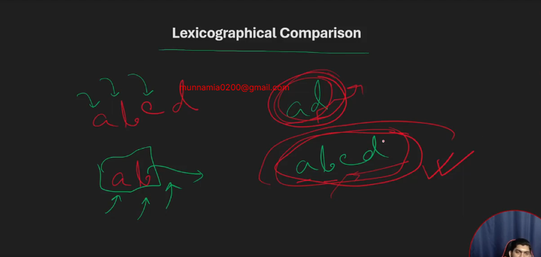
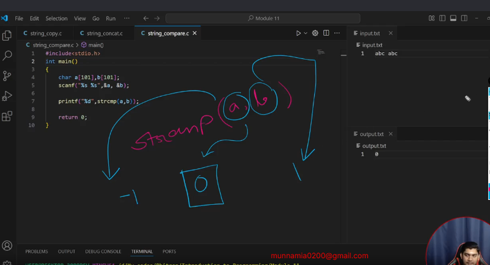

# string operations 

## 11-1 String copy

```c
#include<stdio.h>
int main()
{
    char a[100],b[100];
    scanf("%s %s",&a,&b);
   int length=strlen(b);
   for (int i = 0; i <=length; i++)
   {
  a[i]=b[i];
   }
   printf("%s %s",a,b);
    return 0;
}
```

## 11-3 String copy using strcpy

```c
#include<stdio.h>
int main()
{
    char a[100],b[100];
    scanf("%s %s",&a,&b);
  strcpy(a,b);
   printf("%s %s",a,b);
    return 0;
}
```

## 11-4 String concat

```c
#include <stdio.h>
int main()
{
    char a[101], b[101];
    scanf("%s %s", &a, &b);
    int length_a = strlen(b);
    int length_b = strlen(b);
    for (int i = 0; i <=length_b; i++)
    {
        a[i+length_a] = b[i];
    }
printf("%s %s",a,b);
    return 0;
}
```

## 11-6 String concat with strcat

```c
#include <stdio.h>
int main()
{
    char a[101], b[101];
    scanf("%s %s", &a, &b);
  strcat(a,b);
printf("%s %s",a,b);
    return 0;
}
```

## 11-7 What is lexicographical comparison
- alphabitical order in the dictionary


## 11-8 String compare

```c
#include <stdio.h>

int main()
{
    char a[101], b[101];
    scanf("%s %s", &a, &b);
    int i = 0;
    while (1)
    {
        if (i[a] == '\0' && b[i] == '\0')
        {
            printf("equal");
            break;
        }
        else if (a[i] == '\0')
        {
            printf("a is smaller");
            break;
        }
        else if (b[i] == '\0')
        {
            printf("b is smaller");
            break;
        }
        else if (a[i] < b[i])
        {
            printf("a is smaller");
            break;
        }
        else if (a[i] > b[i])
        {
            printf("b is smaller");
            break;
        }
        else if (a[i] == b[i])
        {
          i++;
        }
    }

    return 0;
}
```

## 11-10 String compare using strcmp



```c
// #include <stdio.h>

// int main()
// {
//     char a[101], b[101];
//     scanf("%s %s", &a, &b);
//     int i = 0;
//     while (1)
//     {
//         if (i[a] == '\0' && b[i] == '\0')
//         {
//             printf("equal");
//             break;
//         }
//         else if (a[i] == '\0')
//         {
//             printf("a is smaller");
//             break;
//         }
//         else if (b[i] == '\0')
//         {
//             printf("b is smaller");
//             break;
//         }
//         else if (a[i] < b[i])
//         {
//             printf("a is smaller");
//             break;
//         }
//         else if (a[i] > b[i])
//         {
//             printf("b is smaller");
//             break;
//         }
//         else if (a[i] == b[i])
//         {
//           i++;
//         }
//     }

//     return 0;
// }

// second way 
// #include <stdio.h>

// int main()
// {
//     char a[101], b[101];
//     scanf("%s %s", &a, &b);
//     printf("%d",strcmp(a,b));

//     return 0;
// }

// thrid way
#include <stdio.h>

int main()
{
    char a[101], b[101];
    scanf("%s %s", &a, &b);
 int val=strcmp(a,b);
 if(val<0){
    printf("a is smaller");
 }else if(val==0){
       printf("equal");
       } else if(val>0){
       printf("B is smaller");
 }}
 
```

## 11.5-1 Frequency Array I

```c
#include<stdio.h>
int main()
{
    int n;
    scanf("%d",&n);
    int a[n];
    for (int i = 0; i < n; i++)
    {
       scanf("%d",&a[i]);
    }
    int cnt0=0,cnt1=0,cnt2=0,cnt3=0,cnt4=0,cnt5=0;
    for (int i = 0; i < n; i++)
    {
        if(a[i]==0)
        {
            cnt0++;
        }
        if(a[i]==1)
        {
            cnt1++;
        }
        if(a[i]==2)
        {
            cnt2++;
        }
        if(a[i]==3)
        {
            cnt3++;
        }
        if(a[i]==4)
        {
            cnt4++;
        }
        if(a[i]==5)
        {
            cnt5++;
        }
    }
    printf("%d -> %d\n",0,cnt0);
    printf("%d -> %d\n",1,cnt1);
    printf("%d -> %d\n",2,cnt2);
    printf("%d -> %d\n",3,cnt3);
    printf("%d -> %d\n",4,cnt4);
    printf("%d -> %d\n",5,cnt5);
    return 0;
}
```

## 11.5-2 Frequency Array II

- real shortcut logic

```c
#include<stdio.h>
int main()
{
    int n;
    scanf("%d",&n);
    int a[n];
    for (int i = 0; i < n; i++)
    {
       scanf("%d",&a[i]);
    }
  int freq[6]={0};
    for (int i = 0; i < n; i++)
    {
        int val = a[i];
        freq[val]++;
    }
for (int i = 0; i < 6; i++)
{
  printf("%d -> %d\n",i,freq[i]);
}

    return 0;
}
```